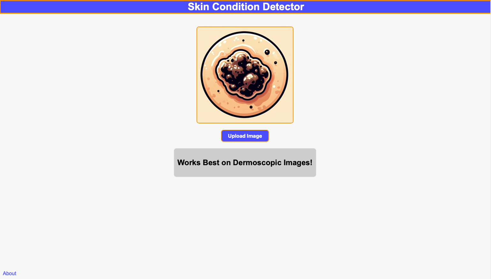

# Skin Lesion Classifier
## Overview

This repository hosts the complete source code for a web-based skin lesion classification tool. The project includes a ResNet-50 model trained to identify various types of skin lesions, which is integrated into a Flask-based web application.

## Features
* **Model Code**: Code that contains the NN_model that repre*sents various models based on input parameters
* **Flask Web Application**: A lightweight backend using Flask to serve the model and handle user interactions.
* **Interactive Web Interface**: Users can upload images of skin lesions and receive instant classification results.

## Preview


## Getting Started
### Installation
1. Clone the repository:

```bash
git clone https://github.com/antonio-revilla/Skin-Lesion-Classify.git
```
2. Navigate to the repo directory:
```bash
pip install -r requirements.txt
```

### Running the Website
1. Set the flask app enviroment
```bash
export FLASK_APP=main.py
```
2. Run the flask app
```bash
flask run
```

### Training the and exporting the model
* The process for cleaning the data and training the model is included in `data_processing.ipynb`
* The dataset is the HAM10000 dataset that can be downloaded here: [HAM10000 Kaggle](https://www.kaggle.com/datasets/kmader/skin-cancer-mnist-ham10000)